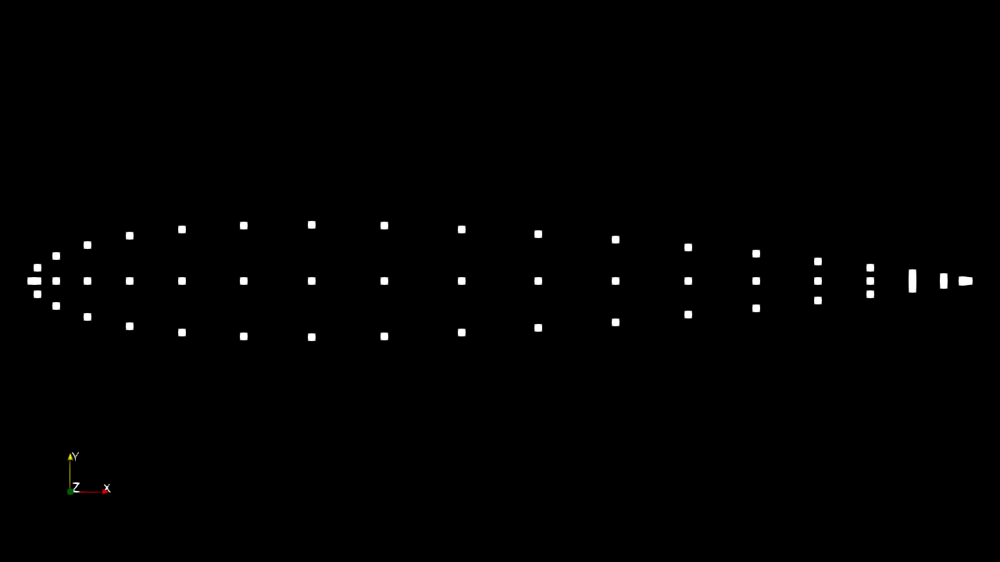
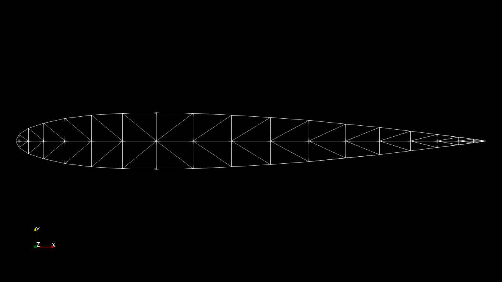

# 📐 Delaunay Triangulation: Bowyer-Watson Algorithm
This project is a C++ implementation of the Bowyer-Watson algorithm to generate a Delaunay Triangulation of a set of 2D points.

A Delaunay Triangulation is a triangulation of a set of discrete points such that no point is inside the circumcircle of any triangle. This property maximizes the minimum angle of all triangles, which is essential in various applications like Computational Fluid Dynamics Modeling, Finite Element Analysis, and meshing.

<div align="center">
  <table>
    <tr>
      <td align="center">
        
        <br>Input Point Cloud
      </td>
      <td align="center">
        
        <br>Delaunay Triangulation
      </td>
    </tr>
  </table>
</div>

## ✨ Features

* **Geometric Primitives:** Custom `Point`, `Edge`, and `Triangle` structures defined for clear geometric representation and manipulation.
* **Circumcircle Test:** Uses an efficient determinant calculation (`inCircumcircle`) to implement the crucial Delaunay empty circumcircle property.
* **Super Triangle Handling:** Correctly initializes and removes the large bounding "super triangle" required by the Bowyer-Watson approach.
* **VTK Export:** Functionality to export the resulting 2D mesh to a **VTK (Visualization Toolkit)** file format (`triangulation.vtk`), enabling visualization in professional software like ParaView.
* **Performance:** Includes `std::chrono` for precise timing of the triangulation process.


## 🚀 Getting Started

To compile and run the project, you need a standard C++ development environment.

### Prerequisites

* A C++ compiler that supports C++11 or later (e.g., `g++` or `clang`).
* Standard C++ libraries only (no external dependencies).

### Compilation and Execution

1.  **Compile the code:**
    Use your C++ compiler to generate an executable file (named `delaunay` in this example).
    ```bash
    g++ -o delaunay main.cpp -std=c++11
    ```

2.  **Run the executable:**
    Execute the compiled program from your terminal.
    ```bash
    ./delaunay
    ```

### Output

The program will print the computation statistics and generate the VTK file:
The final mesh can be found in the `triangulation.vtk` file.
